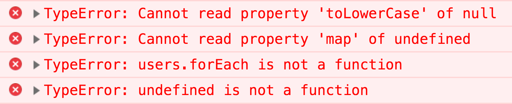

---

# Rafał Pocztarski

You may know me from Stack Overflow

[](https://stackoverflow.com/users/613198/rsp)

# pocztarski.com

Enough about me

---
Few days ago

<a href="https://www.quora.com/profile/Rafa%C5%82-Pocztarski">

</a>

My reaction: WTF?! Why I don't have followers?!

---

# Call me irresponsible

if I ever crash on null or undefined<br>in JavaScript or TypeScript

---

# Call me irresponsible

if I ever crash on null or undefined<br>&nbsp;

---

# Call me irresponsible

if I ever crash<br>&nbsp;

---

<i>
Call me irresponsible, call me unreliable<br>
Throw in undependable, too<br>
Do my foolish alibis bore you?<br>
Well, I'm not too clever, I just adore you
</i>

a song about irresponsible software development<br>composed by Jimmy Van Heusen<br>with lyrics by Sammy Cahn

---

Who has ever designed a network protocol?

---

Who has ever been in a dialog like this?

<br><i>"Can you add ID to GET /users/me endpoint?"</i>

<br><i>"OK, it will be &nbsp;`userId`&nbsp; field in JSON"</i>

---

Discussing REST endpoints is designing a network protocol

---

A simplified* model of a typical protocol stack

<small>
client's implementation of our custom REST API<br>
clients's application layer (HTTP)<br>
client's session/presentation layer (SSL)<br>
client's transport layer (TCP)<br>
client's network layer (IPv4 + NAT)<br>
client's data link layer (Wi-Fi)<br>
client's physical layer (microwaves)<br>
(Wi-Fi access point and several routers in between)<br>
server's physical layer (network cable)<br>
server's data link layer (ethernet)<br>
server's network layer (IPv4)<br>
server's transport layer (TCP)<br>
server's session/presentation layer (SSL)<br>
server's application layer (HTTP)<br>
server's implementation of our custom REST API
</small>

---

<small>
*) The simplified model didn't include:

access points, routers, name servers, proxies, load balancers, content delivery networks, backbones, databases, external services

the same application may work over both IPv4 and IPv6

it can use HTTPS, HTTP/2 and SPDY depending on the connecting client

the API may use REST, GraphQL, gRPC, SOAP, WebSocket

the client itself might be connected over ethernet, Wi-Fi, LTE etc. and even switch network types or cell towers or access points while using the application
</small>

---

A simplified simplified model of a typical stack

<small>
client's implementation of our custom REST API<br>
(several layers in between)<br>
server's implementation of our custom REST API
</small>

---

We are designing a network protocols so we need to know

RFC 1122: Requirements for Internet Hosts - Communication Layers

RFC 1123: Requirements for Internet Hosts - Application and Support

---

"Software should be written to deal with every conceivable error, no matter how unlikely"

"the most serious problems in the Internet have been caused by unenvisaged mechanisms triggered by low-probability events"

"if a protocol specification defines four possible error codes, the software must not break when a fifth code shows up"

---

Robustness principle

"Be liberal in what you accept,<br>and conservative in what you send"

---

Robustness principle

"Be conservative in what you send"
<br><small>(your code should always produce correct data)</small>

"Be liberal in what you accept"
<br><small>(your code must never crash when receiving incorrect data)</small>

---

Robustness principle
<br>for a typical RESTful API consumer and provider

The frontend must always send proper request with correct data
<br>(but if it doesn't then the backend cannot crash!)

The backend must always send proper response with correct data
<br>(but if it doesn't then the frontend cannot crash!)

---

When Jackie Gleason was singing about "foolish alibis" in the "Call me irresponsible" song, what he meant was a situation like this:

Backend crashes and the backend developer blames the frontend:

"It's not my fault! It's the fault of frontend developers because they sent me a bad request!"

Frontend crashes and the frontend developer blames the backend:

"It's not my fault! It's the fault of backend developers because they sent me a bad response!"

---



---

NULL is called a billion dollar mistake by its inventor not without a reason

In JavaScript we have both `null` and `undefined` so we are twice as lucky

---

Developer about frontend craching in production because of getting null from the backend:

"please do not accuse car engine if you pour the wrong kind of gas."

---


---


---

The checking was there but it was not good enough

`x = a.b.c || 'default';`

Worked when `c` was missing but crashed when `b` was missing

---

Changing this:

`x = a.b.c || 'default';`

to:

`x = _.get(a, 'b.c', 'default');`

fixed the problem.

---

How to make sure that it's impossible to make a mistake like this

---

All error and exceptions must be handled properly
The application must not crash on any error

Use TypeScript with restricted config

---
TypeScript

```
{
  "compilerOptions": {
    "noImplicitAny": true,
    "noImplicitThis": true,
    "alwaysStrict": true,
    "strictNullChecks": true,
    "strictFunctionTypes": true,
    "strictPropertyInitialization": true,
    "noImplicitReturns": true,
    "noUnusedLocals": true,
    "noUnusedParameters": true
  }
}
```

---

TSLint

```
{
  "rules": {
    "no-any": true,
    "no-null-keyword": true
}
```

---

TypeStrict

TSLint config focused on maximizing type safety

---

Resources

<small>
- [RFC 1122: Requirements for Internet Hosts - Communication Layers](https://tools.ietf.org/html/rfc1122)
- [RFC 1123: Requirements for Internet Hosts - Application and Support](https://tools.ietf.org/html/rfc1123)
- [Robustness principle on Wikipedia](https://en.wikipedia.org/wiki/Robustness_principle)
- [Covariance and contravariance on Wikipedia](https://en.wikipedia.org/wiki/Covariance_and_contravariance_(computer_science))

</small>

---

# Questions?

Slides: https://pocztarski.com/cmi

## Rafał Pocztarski

## [pocztarski.com](https://pocztarski.com)

“Be liberal in what you accept, and conservative in what you send.” - Postel's law
