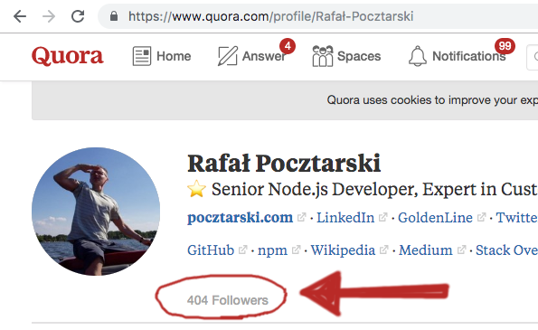

---

# Rafał Pocztarski

You may know me from Stack Overflow

# pocztarski.com

Enough about me

---
Few days ago

My reaction: WTF?! Why I don't have followers?!

---

# Call me irresponsible if I ever crash on null or undefined in JavaScript or TypeScript

---

---

# Questions?

Slides: https://pocztarski.com/cmi

## Rafał Pocztarski

## [pocztarski.com](https://pocztarski.com)

“Be liberal in what you accept, and conservative in what you send.” - RFCs 1122 and 1123
