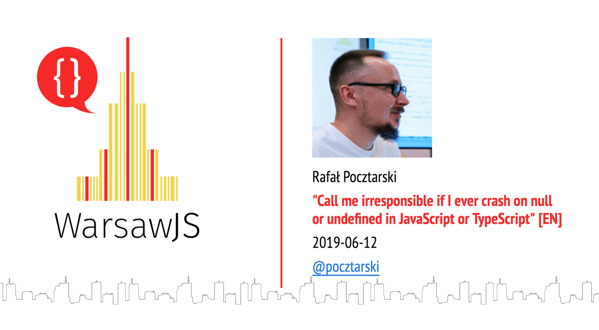

---

# Rafał Pocztarski

You may know me from Stack Overflow

# pocztarski.com

Enough about me

---
Few days ago

My reaction: WTF?! Why I don't have followers?!

---

# Call me irresponsible

if I ever crash on null or undefined in JavaScript or TypeScript

---

# Call me irresponsible

if I ever crash on null or undefined

---

# Call me irresponsible

if I ever crash

---

<small>
<i>
Call me irresponsible, call me unreliable 
Throw in undependable, too 
Do my foolish alibis bore you? 
Well, I'm not too clever, I just adore you 
Call me unpredictable, tell me I'm impractical 
Rainbows, I'm inclined to pursue 
Call me irresponsible, yes, I'm unreliable 
But it's undeniably true 
I'm irresponsibly mad for you
</i>
</small>

a song about irresponsible software development composed by Jimmy Van Heusen with lyrics by Sammy Cahn

---

# Questions?

Slides: https://pocztarski.com/cmi

## Rafał Pocztarski

## [pocztarski.com](https://pocztarski.com)

“Be liberal in what you accept, and conservative in what you send.” - RFCs 1122 and 1123
